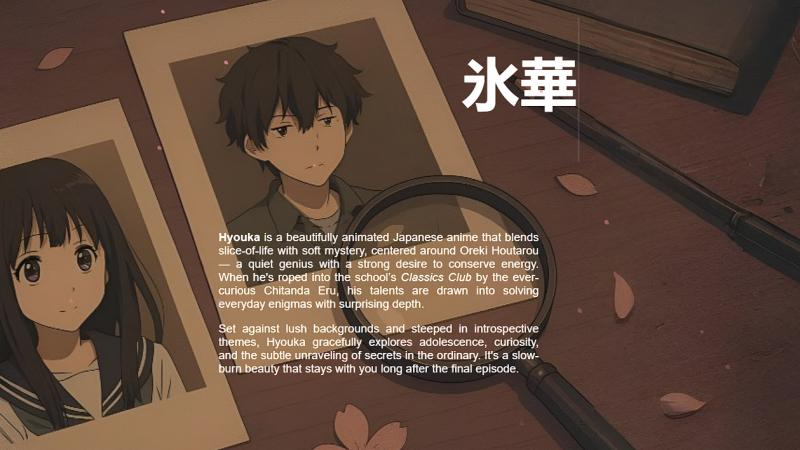
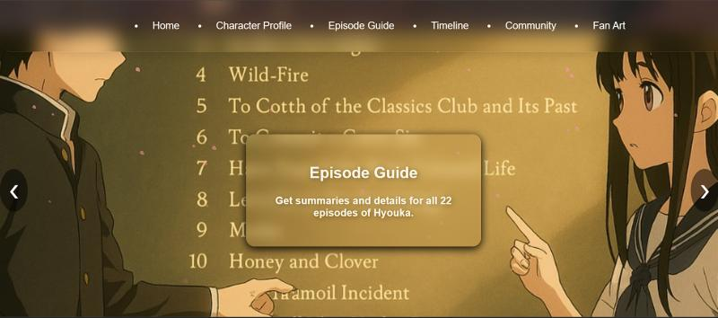
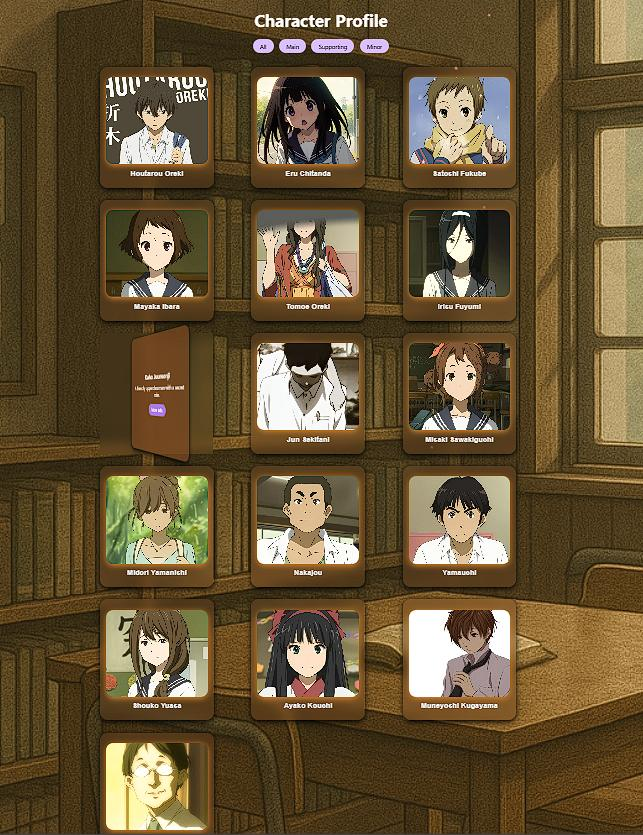
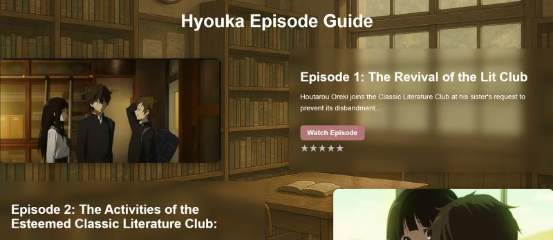
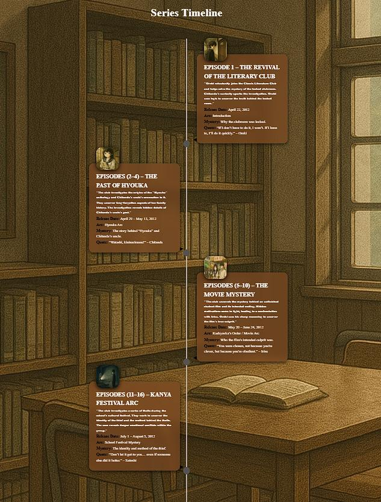
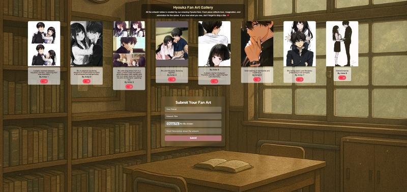

# 🌸 Kotenbuk – Hyouka Anime Fan Website

A beautiful fan-made tribute site dedicated to the anime *Hyouka* by Kyoto Animation. This website offers detailed character profiles, episode summaries with ratings, a timeline of events, a fan art gallery, and a lightweight community forum — all wrapped in a mystery-themed aesthetic that mirrors the show’s charm.

---

## 🎯 Project Objective

To create a responsive, visually elegant, and fully interactive fan site honoring *Hyouka*, complete with multiple pages, aesthetic animations, and front-end-only functionality using LocalStorage.

---

## 🚀 Live Demo

🔗 [Visit the Website](https://kotenbuk.vercel.app/)

---

## 🖥️ Tech Stack

- HTML5 + CSS3 + JavaScript (ES6)
- LocalStorage for persistent data (forum, ratings)
- Custom page-wise scripts and styles
- No backend or databases

---

## 🌟 Features

### 🏠 Homepage
- Typewriter intro animation
- Fullscreen section carousel
- Sticky navbar with mystery-themed design

### 👤 Characters
- 3D flip cards with character details
- Modal popups for extended info
- Filter by role (main, supporting, minor)

### 🎬 Episodes
- Alternating layout for 22 episodes
- Star rating system (1–5 stars) saved in LocalStorage
- Episode summaries and YouTube watch links

### 🕰️ Timeline
- Timeline of all episodes with dot navigation
- Summarized story progression in a clean scrollable layout

### 🎨 Fan Art
- Upload and preview fan art
- Name/title fields
- Lightbox gallery viewer

### 💬 Community Forum
- Post creation with usernames
- Like system and expandable replies
- All content saved locally in-browser

### 🍃 Visuals & Animations
- Animated falling petals
- Soft muted color palette inspired by Hyouka
- Smooth transitions and hover effects

---

## 📸 Screenshots

**Landing Page**  
  


**Character Profiles**  


**Episode Guide**  


**Timeline**  


**Fan Art Gallery**  


**Community Forum**  


---
## 📁 Folder Structure


```
hyouka-fan-website/
├── index.html         # Landing Page 
├── characters.html   # Character Profiles 
├── episodes.html     # Episode Guide 
├── timeline.html     # Series Timeline 
├── community.html     # Community Forum 
├── fanart.html   # Fan Art Gallery 
├── style-homepage.css   # CSS for homepage 
├── style-characters.css   # CSS for characters 
├── style-episodes.css   # CSS for episodes 
├── style-timeline.css   # CSS for timeline 
├── style-community.css   # CSS for forum 
├── style-fanart.css       # CSS for fan art 
├── script-homepage.js     # JS for homepage 
├── script-characters.js   # JS for characters 
├── script-episodes.js     # JS for episode logic 
├── script-timeline.js     # JS for timeline 
├── script-community.js    # JS for forum 
├── script-fanart.js       # JS for fan art 
├── [all images] # Images are stored directly here 
└── README.md # This file
```

> ✅ Each page has its own separate CSS and JS file for better modularity and easier maintenance.

---

## ⚙️ Setup Instructions

### 1. Clone the Repository

```bash
git clone https://github.com/Aadya2901/hyouka_anime_fan_website.git
cd hyouka-fan-website


### 2. Open Locally

# Option 1: Open any HTML file in your browser
open homepage.html

# Option 2: Use Live Server (recommended for dev)
npm install -g live-server
live-server


### 3. Deploy on GitHub Pages (Optional)
Push your repo to GitHub

Go to Settings > Pages

Set source branch to main and directory to /root

Your live site will be available at 🔗 [Visit the Website](https://hyouka-anime-fan-website.vercel.app/)


📸 Screenshots

### Landing Page


### Character Profiles


### Episode Guide


### Timeline


### Fan Art Gallery


### Community Forum


## 👥 Contributors

| Name                                                   | Role                                                                         |
|--------------------------------------------------------|------------------------------------------------------------------------------|
| [Aadya2901](https://github.com/Aadya2901)              | Homepage, Character Profiles, Deployment, Responsiveness                     |
| [iam-anish15](https://github.com/iam-anish15)          | Timeline, Character Profiles, Homepage, Responsiveness,                      |
| [ananyamishra13](https://github.com/ananyamishra13)    | Fan Art Gallery, Episode Guide                                               |
| [AANYARAI](https://github.com/AANYARAI)                | Page Linking                                                                 |


🤝 Contributing
We welcome contributions, improvements, or just bug fixes. Here's how:

1. Fork the project
2. Create your feature branch (`git checkout -b feature/YourFeature`)
3. Commit your changes (`git commit -m 'Add your feature'`)
4. Push to the branch (`git push origin feature/YourFeature`)
5. Open a Pull Request

📝 License
This project is open source and available under the MIT License.
Feel free to use it for personal or educational purposes.

💬 Final Note
“If I don’t have to do it, I won’t. If I have to do it, I’ll make it quick.” – Oreki Houtarou

Thank you for checking out our tribute to Hyouka. We hope you enjoy exploring it as much as we enjoyed building it 💜
